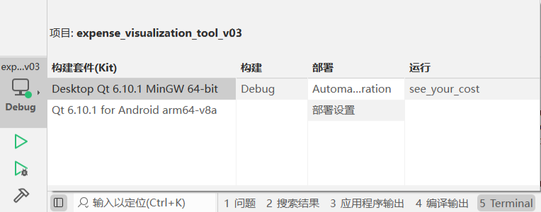
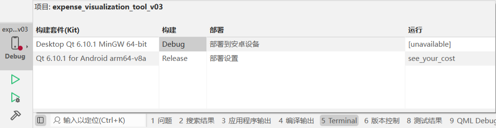
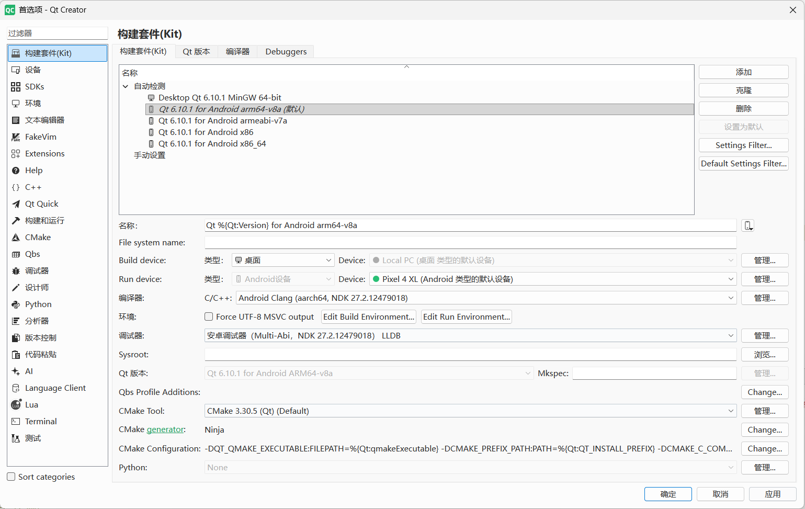
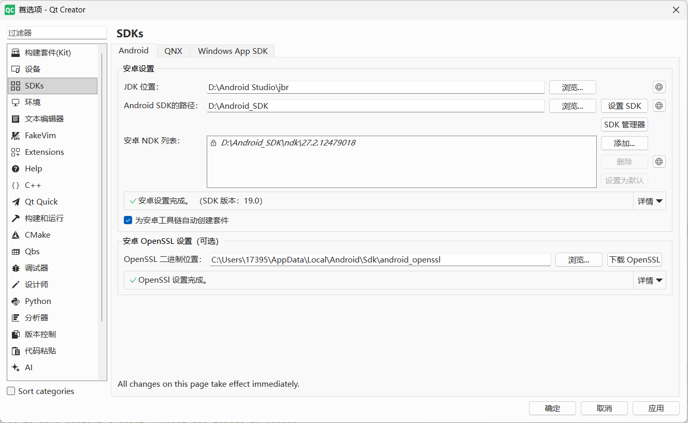

# Installation & Build Guide

## System Requirements

### Minimum Requirements

- **Qt 6.10.1** or higher
- **CMake 3.30** or higher
- C++17 compatible compiler

### Android Deployment

- Android SDK 19.0+
- Android NDK 27.2+
- Android arm64-v8a platform

## Getting Started

### Clone the Repository

```bash
git clone https://github.com/Turtle233/expense_visualization_tool.git
cd expense_visualization_tool
```

## Build Methods

### Method 1: Using Qt Creator (Recommended)

1. **Open the Project**
   - Launch Qt Creator
   - Go to `File` → `Open File or Project`
   - Navigate to the project root and select `CMakeLists.txt`
   - Qt Creator will auto-configure the project

2. **Select a Kit**
   - For Desktop: Choose "Desktop Qt 6.10.1" with your compiler (MinGW/MSVC/GCC)
   - For Android: Choose "Qt 6.10.1 for Android arm64-v8a"

3. **Build the Project**
   - Click `Build` → `Build Project "see_your_cost"`
   - Or press `Ctrl+B`

4. **Run**
   - For Desktop: Click the Run button (▶)
   - For Android: Connect a device/emulator and click Run

### Method 2: Command Line Build

#### Desktop Build

```bash
mkdir build
cd build
cmake -DCMAKE_PREFIX_PATH=<QT_HOME>/6.10.1/gcc_64 ..
cmake --build .
```

Replace `<QT_HOME>` with your actual Qt installation path (e.g., `C:/Qt` or `D:/Qt`).



#### Android Build

```bash
mkdir build-android
cd build-android
cmake -DCMAKE_PREFIX_PATH=<QT_HOME>/6.10.1/android_arm64_v8a \
      -DCMAKE_TOOLCHAIN_FILE=<QT_HOME>/6.10.1/android_arm64_v8a/lib/cmake/Qt6/qt.toolchain.cmake \
      ..
cmake --build .
```

Replace:

- `<QT_HOME>` with your Qt installation path (e.g., `C:/Qt` or `D:/Qt`)
- Adjust the path if using a different Android ABI (e.g., `android_armv7a` instead of `android_arm64_v8a`)



## Android Development Setup

### Environment Configuration

Configure the following paths in Qt Creator:

#### Required Paths

Replace the paths below with your actual installation directories:

- **Android SDK**: `<ANDROID_SDK_ROOT>` (e.g., `D:\Android_SDK`)
- **Android SDK Platform-Tools**: `<ANDROID_SDK_ROOT>\platform-tools`
- **Android NDK**: `<ANDROID_SDK_ROOT>\ndk\<NDK_VERSION>` (e.g., `D:\Android_SDK\ndk\27.2.12479018`)
- **OpenSSL**: `%USERPROFILE%\AppData\Local\Android\Sdk\android_openssl`
- **Qt for Android (arm64-v8a)**: `<QT_HOME>\6.10.1\android_arm64_v8a\bin` (e.g., `D:\Qt\6.10.1\android_arm64_v8a\bin`)

#### Qt Creator Configuration

Go to **Preferences → Kits** and **Preferences → SDKs** to configure:

**Kit Configuration Example:**

- Select the appropriate Android Kit: "Qt 6.10.1 for Android arm64-v8a"
- CMake Tool: CMake 3.30+ (Qt)
- CMake Generator: Ninja
- Compiler: Android Clang (arch64, NDK 27.2+)
- Debugger: Android's gdb



**SDK Configuration Example:**

- **JDK**: `<ANDROID_STUDIO_HOME>\jbr` (Usually auto-detected)
- **Android SDK**: `<ANDROID_SDK_ROOT>` (e.g., `D:\Android_SDK`)
- **Android NDK**: `<ANDROID_SDK_ROOT>\ndk\<NDK_VERSION>` (e.g., `D:\Android_SDK\ndk\27.2.12479018`)
- **OpenSSL**: `%USERPROFILE%\AppData\Local\Android\Sdk\android_openssl`



### Real Device Development (Recommended)

**System Requirements:**

- Android 10 or higher
- USB debugging enabled

**Setup Steps:**

1. Connect your Android device via USB
2. Enable Developer Options: Settings → About Phone → Tap "Build Number" 7 times
3. Enable USB Debugging: Settings → Developer Options → USB Debugging
4. Grant USB file transfer permissions when prompted
5. _(Optional)_ Use **Anlink** for remote screen mirroring and debugging

**Build & Deploy:**

- Select your device from Run configuration
- Press `Ctrl+R` or click the Run button to build and deploy

### Android Emulator Development

**Recommendation:**

- Use Android x86_64 emulator created in Qt Creator (better compatibility)
- Avoid ARM-based emulators for faster performance on x86/x64 systems

**Setup Steps:**

1. Go to **Preferences → Devices**
2. Create a new Android Virtual Device (AVD) with x86_64 architecture
3. Start the emulator before building
4. Run the application on the emulator

## Project Dependencies

The project automatically finds the required Qt components:

- Qt6::Quick
- Qt6::QuickControls2
- Qt6::LinguistTools (for internationalization)

## Troubleshooting

- **Qt not found**: Ensure Qt 6.10.1 is installed and CMake can locate it via `-DCMAKE_PREFIX_PATH`
- **Build fails**: Verify your C++ compiler version supports C++17
- **Android deployment issues**: Check Android SDK/NDK paths are correctly configured in Qt Creator
